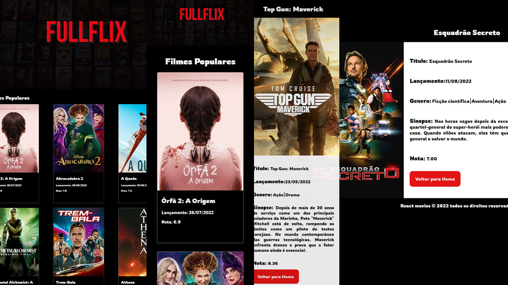

# Desafio Fullture React - Fullflix

## Table of contents

- [Overview](#overview)
    - [The challenge](#the-challenge)
    - [Screenshot](#screenshot)
    - [Links](#links)
- [My process](#my-process)
    - [Built with](#built-with)
    - [What I learned](#what-i-learned)
    - [Continued development](#continued-development)
    - [Useful resources](#useful-resources)
- [Author](#author)

## Overview

### The challenge

Usuarios devem poder:

- Visualizar o layout ideal para o site, independente do tamanho da tela do dispositivo
- Ver os estados de foco para todos os elementos interativos na página
- Ver as informações dos Filmes atuais
- Visualizar informações adicionais sobre cada Filme

### Screenshot



Gif


### Links

- Live Site URL: [https://fullflix-xi.vercel.app/](https://fullflix-xi.vercel.app/)

## My process

### Built with

- Semantic HTML5 markup
- CSS custom properties
- Flexbox
- CSS Grid
- Mobile-first workflow
- React roter
- redux
- consumo de api com axios
- [React](https://reactjs.org/) - JS library
- [Styled Components](https://styled-components.com/) - For styles


### What I learned

Com este projeto eu pude além de colocar em praticar os meus conhecimentos em `HTML` `CSS`  e `ReactJs`, tambem aprender alguns conceitos como:

- Coloquei em prática o uso do `React roter` para as divisões de páginas.

```javascript
<BrowserRouter>
    <Routes>
        <Route index element={<Home/>}/>
        <Route path="/details" element={<Details/>}/>
        <Route path="*" element={<PageNotFound/>}/>
    </Routes>
</BrowserRouter>
```

- Pude praticar o uso do `Styled Components`.

```js
export const Header = styled.header`
display: flex;
align-items: center;
justify-content: center;
height: 5rem;
background-color: ${colors.nightBackground};

h1{
    color: ${colors.colorWhite};
    font-size: 1.8rem;
}
`
```

- Usar os `hooks` `useEfects` e `useState`

```jsx
const [movies, setMovies] = useState([]);

useEffect(()=>{
    goDetails(navigate, details)
},[details, navigate])
```

- criar cards de acordo com informações da `api` utilizando o `.map`

```jsx
movies.map((movie)=>(
    <div key={movie.id}>
        <div className="card" key={movie.id}
             onClick={(event)=> {
                 onClick(event)}}
             id={movie.id}
        >
            
            <div id={movie.id} className="card__content">
                <h2>{movie.title}</h2>
                <p>Lançamento: {format(new Date(movie.release_date), 'dd/MM/yyyy')}</p>
                <p>Nota: {movie.vote_average}</p>
            </div>
        </div>
    </div>))
```

- Consumir `api` atravez do axios usando o `token` pelo `header`

```js
export const getList = (setState) => {
    axios.get(api.urlBase + api.popular + api.languageBr, {
        headers: {
            'Authorization': `Bearer ${api.token}`,
            'Content-Type': `application/json;charset=utf-8`
        }
    })
        .then((response) => {
            setState(response.data.results)
        })
        .catch((error) => {
            console.log(error)
        })
}
```
- uso da biblioteca `Date-fns`

```js
  <h2><b>Lançamento:</b>{format(new Date(state.data.release_date), 'dd/MM/yyyy')}</h2>
}
```
- Usar `Redux` para compartilhar a informação por todo o código

```js
const initialState ={
    value: "Home",
    value2: {}
}
export const counterSlice = createSlice({
    name: 'page',
    initialState,
    reducers:{
        goToIndex: (state)=>{
            state.value = "Home"
        },
        goToDetail: (state)=>{
            state.value = "Detail"
        },
        getMovieDetails: (state, action)=>{
            state.value2 = action.payload
        }
    }
})
export const {goToIndex, goToDetail, getMovieDetails } = counterSlice.actions;

export default counterSlice.reducer;

const state2 = useSelector((state)=> state.page.value)
```
- usar os `reducers` para alterar ou incluir informações no `redux`.

```js
const dispatch = useDispatch();

dispatch(goToDetail())
```

- capturar informações do `store` do `Redux`

```js
const state2 = useSelector((state)=> state.page.value)
```
- usar o `useNavigate` para mudar de página

```js
const navigate = useNavigate()

navigate('/details')
```

### Continued development

Estou em busca de aperfeiçoar ainda mais o React e aprender sobre mongoDb


### Useful resources

- [Date-FNS](https://date-fns.org/) - Me ajudou com a formatação das datas.

## Author

- Linkdin - [Marco Tullio Franca](https://www.linkedin.com/in/marco-franca/)
- Frontend Mentor - [@MarcoFranca](https://www.frontendmentor.io/profile/MarcoFranca)